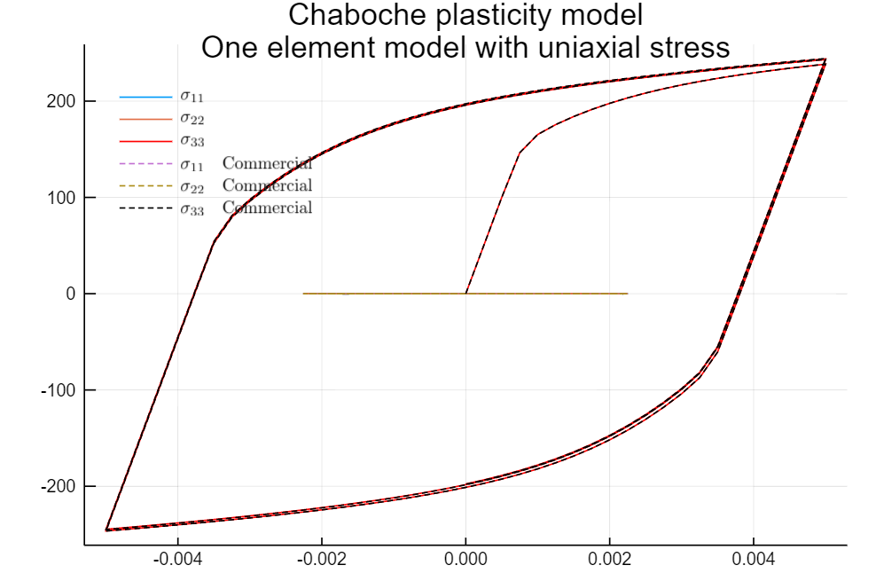

# Materials.jl

A computational material models package for JuliaFEM, concentrating on plasticity and viscoplasticity.

The public API is defined in [src/Materials.jl](src/Materials.jl). For details, see the docstrings. For usage examples, see the [automated tests](test/).

[![][gitter-img]][gitter-url]
[![][travis-img]][travis-url]
[![][coveralls-img]][coveralls-url]
[![][docs-stable-img]][docs-stable-url]
[![][docs-latest-img]][docs-latest-url]
[![][issues-img]][issues-url]
[![][appveyor-img]][appveyor-url]

[gitter-img]: https://badges.gitter.im/Join%20Chat.svg
[gitter-url]: https://gitter.im/JuliaFEM/JuliaFEM.jl

[travis-img]: https://travis-ci.org/JuliaFEM/Materials.jl.svg?branch=master
[travis-url]: https://travis-ci.org/JuliaFEM/Materials.jl

[docs-stable-img]: https://img.shields.io/badge/docs-stable-blue.svg
[docs-stable-url]: https://juliafem.github.io/Materials.jl/stable
[docs-latest-img]: (https://img.shields.io/badge/docs-latest-blue.svg
[docs-latest-url]: https://juliafem.github.io/InterfaceMechanics.jl/latest

[coveralls-img]: https://coveralls.io/repos/github/JuliaFEM/Materials.jl/badge.svg?branch=master
[coveralls-url]: https://coveralls.io/github/JuliaFEM/Materials.jl?branch=master

[issues-img]: https://img.shields.io/github/issues/JuliaFEM/Materials.jl.svg
[issues-url]:  https://github.com/JuliaFEM/Materials.jl/issues

[appveyor-img]: https://ci.appveyor.com/api/projects/status/akjpmgbfjv97t4ts?svg=true
[appveyor-url]: https://ci.appveyor.com/project/JuliaFEM/materials-jl
